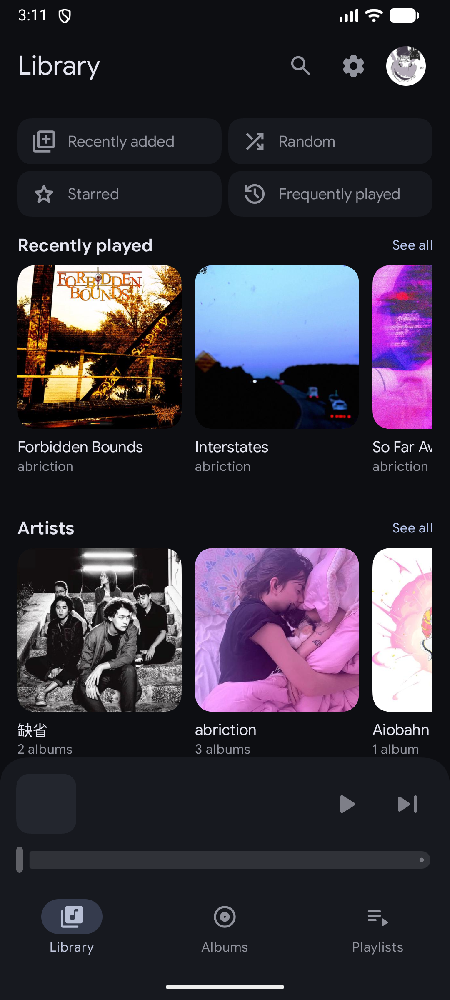
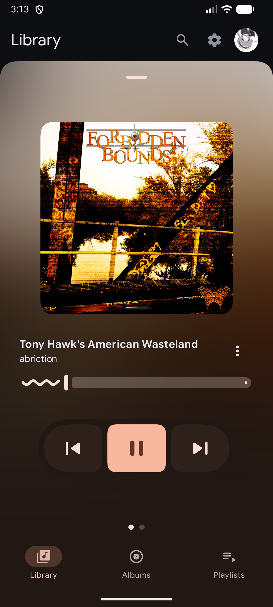
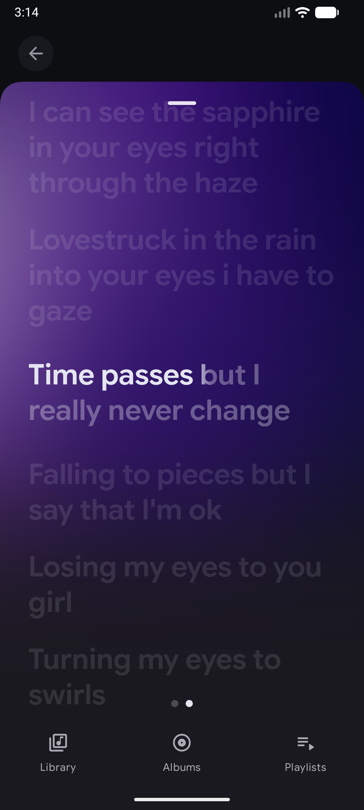
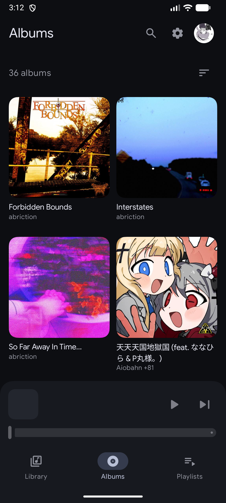

# Navic
Navidrome client app for Android and iOS, featuring the Material 3
Expressive design language.

[][ADD_TO_OBTAINIUM]
[][ALTSOURCE]
[][LATEST_RELEASE]

## Features
* An intuitive and familiar UI
* Customizable, many settings and more to come
* Pretty lightweight and fast
* Secure and private: no permissions, doesn't connect to anything beside your instance
* Integrated into your system: shows up on the lock screen + quick settings
* Feature rich, implements most subsonic APIs
* Open source: features are being added and bugs are being fixed actively

## Screenshots
|         Library          |         Player          |         Lyrics          |         Albums          |
|:------------------------:|:-----------------------:|:-----------------------:|:-----------------------:|
|  |  |  |  |

## Star History
<a href="https://star-history.com/#paigely/Navic&Date">
 <picture>
   <source media="(prefers-color-scheme: dark)" srcset="https://api.star-history.com/svg?repos=paigely/Navic&type=Date&theme=dark" />
   <source media="(prefers-color-scheme: light)" srcset="https://api.star-history.com/svg?repos=paigely/Navic&type=Date" />
   
 </picture>
</a>

## Contributing
Don't use AI please, it wastes my time and I will close your PR if you do

## Acknowledgements
This project uses a heavily altered version
of [siper/subsonic-api](https://github.com/siper/subsonic-api)
which is under the MIT licence. Other acknowledgements may be found inside the app, under
Settings > About > Acknowledgements, as there are too many to list here.

[ADD_TO_OBTAINIUM]: https://apps.obtainium.imranr.dev/redirect?r=obtainium://app/%7B%22id%22%3A%22paige.navic%22%2C%22url%22%3A%22https%3A%2F%2Fgithub.com%2Fpaigely%2FNavic%22%2C%22author%22%3A%22paigely%22%2C%22name%22%3A%22Navic%22%2C%22preferredApkIndex%22%3A0%2C%22additionalSettings%22%3A%22%7B%5C%22includePrereleases%5C%22%3Atrue%2C%5C%22fallbackToOlderReleases%5C%22%3Atrue%2C%5C%22filterReleaseTitlesByRegEx%5C%22%3A%5C%22%5C%22%2C%5C%22filterReleaseNotesByRegEx%5C%22%3A%5C%22%5C%22%2C%5C%22verifyLatestTag%5C%22%3Afalse%2C%5C%22sortMethodChoice%5C%22%3A%5C%22date%5C%22%2C%5C%22useLatestAssetDateAsReleaseDate%5C%22%3Afalse%2C%5C%22releaseTitleAsVersion%5C%22%3Afalse%2C%5C%22trackOnly%5C%22%3Afalse%2C%5C%22versionExtractionRegEx%5C%22%3A%5C%22%5C%22%2C%5C%22matchGroupToUse%5C%22%3A%5C%22%5C%22%2C%5C%22versionDetection%5C%22%3Atrue%2C%5C%22releaseDateAsVersion%5C%22%3Afalse%2C%5C%22useVersionCodeAsOSVersion%5C%22%3Afalse%2C%5C%22apkFilterRegEx%5C%22%3A%5C%22%5C%22%2C%5C%22invertAPKFilter%5C%22%3Afalse%2C%5C%22autoApkFilterByArch%5C%22%3Atrue%2C%5C%22appName%5C%22%3A%5C%22%5C%22%2C%5C%22appAuthor%5C%22%3A%5C%22%5C%22%2C%5C%22shizukuPretendToBeGooglePlay%5C%22%3Afalse%2C%5C%22allowInsecure%5C%22%3Afalse%2C%5C%22exemptFromBackgroundUpdates%5C%22%3Afalse%2C%5C%22skipUpdateNotifications%5C%22%3Afalse%2C%5C%22about%5C%22%3A%5C%22%5C%22%2C%5C%22refreshBeforeDownload%5C%22%3Afalse%7D%22%2C%22overrideSource%22%3Anull%7D "Add to Obtainium"
[ALTSOURCE]: https://stikstore.app/altdirect/?url=https://raw.githubusercontent.com/paigely/Navic/refs/heads/master/app-repo.json
[LATEST_RELEASE]: https://github.com/paigely/Navic/releases/latest
